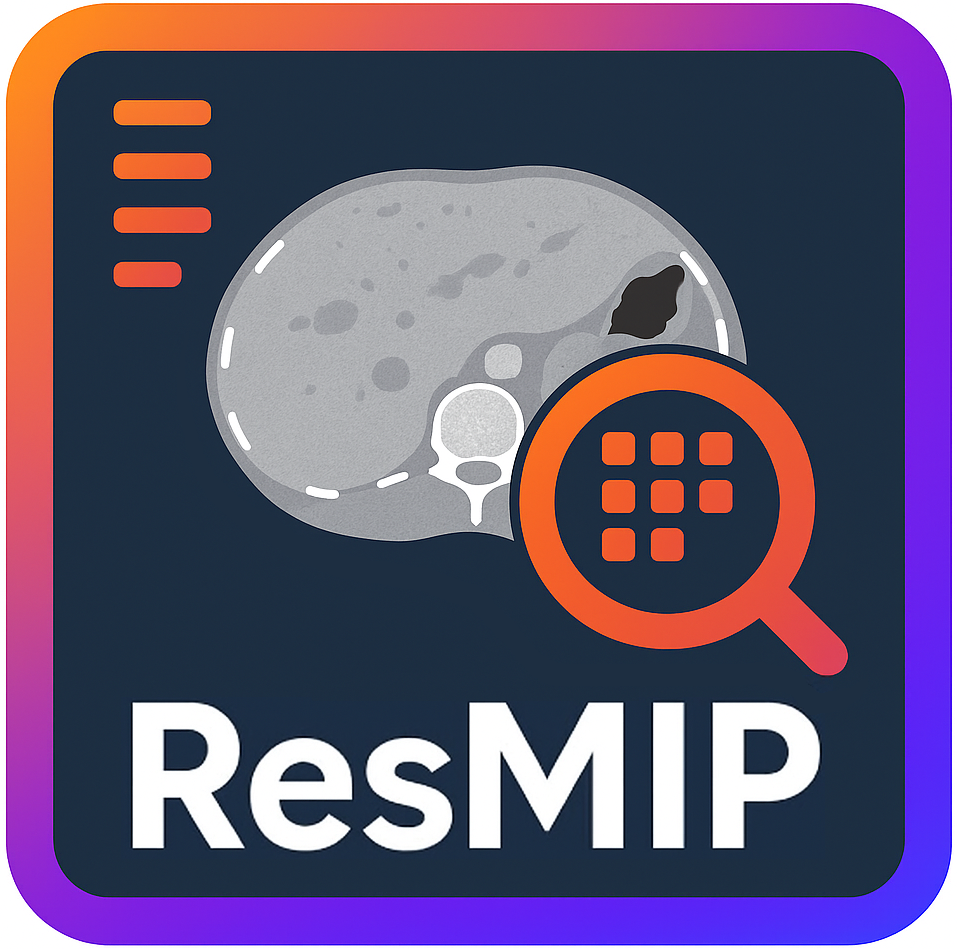

<p align="center">
  <br>
  <align="center"><em> A python-based Reseach library for Medical Image Processing (MIP) </em>
</p>

---

# ResMIP

## Installation and working environment

### Activating the virtual environment

#### Linux / macOS

``` bash
source .venv/bin/activate
```

#### Windows
``` bash
.venv/Scripts/activate
```

### Installation

From within the environment run:
``` bash
pip install poetry
poetry install --no-root
```

#### For development

This library support pre-commit hook scripts (https://pre-commit.com/).
`pre-commit` can be installed using pip.
It is also recommended to install extra dependencies:

``` bash
pip install poetry pre-commit
poetry install --with docs,test
pre-commit install
```


## Usage

`srmip` can read and write 3D images such as CTs, MRIs, PETs in various formats,
including DICOM and ITK formats (such as NIFTI). It also fully supports DICOM RT Structure Sets and
ITK-compatible (e.g.: NIFTI) structures.
`srmip` can also read DICOM RT Dose files and save them to ITK formats.

For more information refer to the documentation.
